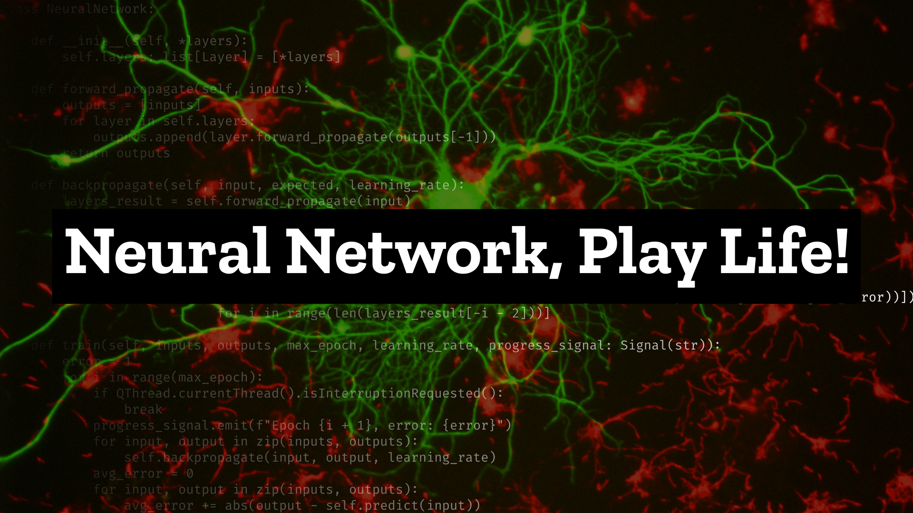

This is a Python GUI application developed using the QT6 framework. The primary objective of this application is to explore the application of a multi-layer neural network in learning the rules of John Conway's Game of Life, a cellular automaton game.

It serves as an educational tool and an exciting demonstration of the capabilities of neural networks in learning complex patterns. It allows users to explore the intricate dynamics of the Game of Life and witness the neural network's ability to predict its evolution.

## Neural network training

At its core, the application employs a multi-layer neural network, which serves as an artificial intelligence component to learn and predict the next states of the cellular automaton. This neural network is trained on a random dataset.

The training process (happening on seperate thread) involves feeding the neural network with the current state of the grid and training it to predict the next state. The network learns the complex rules and patterns of the Game of Life by adjusting the weights and biases in its layers using error backpropagation. The training takes place until certain epoch is approached.

## User interface

The application provides an interactive interface that allows users to observe the Game of Life simulations. The GUI is designed with a user-friendly layout.

Once the neural network is trained, users can initiate simulations and observe how the network predicts the evolution of the Game of Life. The GUI provides controls to retrain the neural network.

## Licences

-  The front image is licensed under a [Creative Commons Attribution-ShareAlike 3.0 Unported License](http://creativecommons.org/licenses/by-sa/3.0/).
- QT ver. 6 is used **without any modifications** in this project via [Open Source License](https://www.qt.io/download-open-source#obligations) ([LGPLv3](https://www.gnu.org/licenses/lgpl-3.0.html)) - obligations apply
